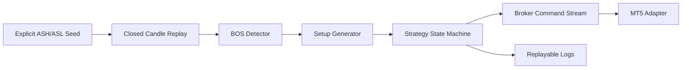

# BOS 75% Retracement Strategy


A structure-first trading engine for a BOS-based 75% retracement strategy, built around deterministic replay, explicit state transitions, and an optional MetaTrader 5 execution adapter.

This project is intentionally conservative: it does not convert market-structure language into generic fractals, zigzags, local pivots, indicators, or optimization filters. BOS is confirmed by candle close only, and wick-only breaks are rejected.

## What It Does

- Tracks active structural high and low inputs without inventing structure.
- Detects bullish and bearish BOS using closed candles only.
- Generates 75% retracement pending limit setups.
- Emits broker-facing pending order and cancellation commands.
- Replays seeded candle fixtures with explainable logs.
- Validates MT5 requests safely through `order_check` before live order sending.

## Strategy Geometry

Bullish BOS:

```text
entry = broken_ASH - 0.75 * (broken_ASH - protected_low)
sl    = protected_low
tp    = broken_ASH
```

Bearish BOS:

```text
entry = broken_ASL + 0.75 * (protected_high - broken_ASL)
sl    = protected_high
tp    = broken_ASL
```

The setup geometry preserves the intended 1:3 structure before symbol tick-size rounding.

## Architecture



## Modules

| Module | Purpose |
| --- | --- |
| `bos75/structure.py` | Close-confirmed BOS checks against active structural levels |
| `bos75/setup_generation.py` | 75% retracement entry, stop, and target geometry |
| `bos75/execution.py` | One-symbol lifecycle state machine |
| `bos75/orders.py` | Broker-facing pending limit and cancel command models |
| `bos75/mt5_adapter.py` | Optional MetaTrader5 Python adapter for order commands |
| `bos75/seeding.py` | Explicit ASH/ASL seeding without automatic swing invention |
| `bos75/replay.py` | Deterministic replay coordinator for seeded closed-candle inputs |
| `bos75/cli.py` | Replay and MT5 safety-check commands |
| `docs/IMPLEMENTATION_RESTATEMENT.md` | Required pre-coding restatement and ambiguity register |

## Quick Start

Run the deterministic test suite:

```powershell
python -m unittest discover -s tests -v
```

Run a replay fixture:

```powershell
python -m bos75.cli replay examples/bullish_replay.json
```

Replay output includes the current state, pending setup or position, broker commands, and replayable decision logs.

## MetaTrader 5

Install the optional MT5 bridge:

```powershell
python -m pip install ".[mt5]"
```

Safe terminal check:

```powershell
python -m bos75.cli mt5-check
```

Safe original-terminal smoke test:

```powershell
python -m bos75.cli mt5-smoke --symbol EURUSD
```

The smoke command builds a far-away pending limit request and validates it through MT5 `order_check`; it does not send an order.

Opt-in original-terminal integration test:

```powershell
$env:BOS75_MT5_INTEGRATION='1'; python -m unittest tests.test_mt5_original_integration -v
```

## Current Validation

- `36` deterministic tests pass locally.
- The original MT5 smoke test passes against a connected demo terminal when explicitly enabled.
- Live `order_send` remains gated until terminal-side trading permission is enabled.

## Open Strategy Decisions

Automatic structure detection is deliberately not finalized yet. The project still needs precise rules for:

- initial ASH/ASL seeding
- expansion-leg start detection
- post-BOS ASH/ASL updates
- OHLC replay ordering when one candle touches multiple lifecycle prices

These are tracked in [Issue #1](https://github.com/rTalhaa/SwingautomateddTrading/issues/1).

## Safety Note

This repository is an engineering implementation of a strategy specification. It is not financial advice, does not guarantee trading performance, and should be tested thoroughly on demo infrastructure before any live use.
